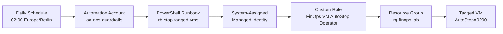
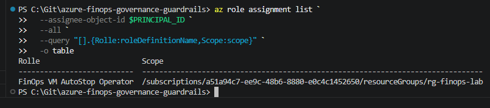
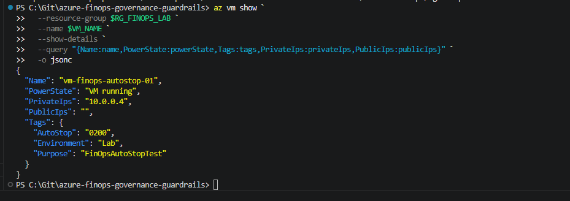
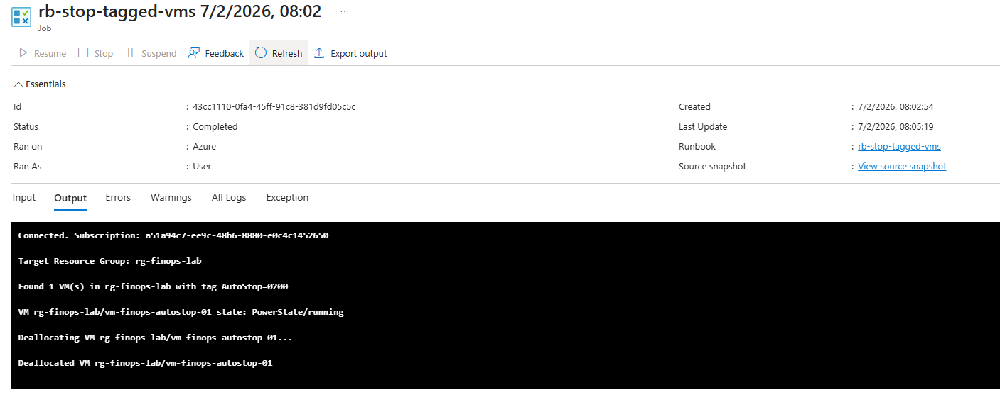
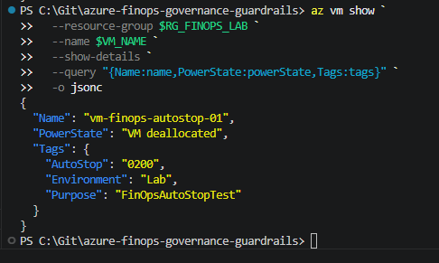
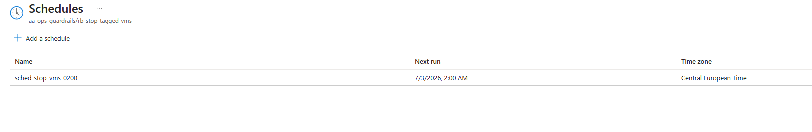

# Module 02 — Nightly VM Auto-Stop

## Tag-Based FinOps Guardrail with Least-Privilege RBAC

This module automatically deallocates Azure virtual machines based on a tag.

The goal is not only to build a working cost-control automation, but to evolve it into a reproducible and auditable governance control using Managed Identity, scoped RBAC, and proof-based validation.

---

## What It Does

The guardrail:

* searches only within the dedicated target resource group `rg-finops-lab`
* identifies VMs with the tag `AutoStop=0200`
* checks the actual runtime state through `PowerState/*`
* deallocates only VMs that are currently running
* authenticates through a system-assigned Managed Identity
* uses a custom Azure RBAC role instead of a broad built-in role
* limits permissions to Resource Group scope

A deallocated VM no longer consumes VM compute resources. Managed disks and other attached resources remain available until they are deleted separately.

---

## Architecture



---

## Evolution: From Automation to Governance

| Area           | V1 — Scheduled AutoStop              | V1.1 — Custom RBAC Hardening                                   |
| -------------- | ------------------------------------ | -------------------------------------------------------------- |
| Trigger        | Daily schedule at 02:00              | Unchanged                                                      |
| Target scope   | Subscription-wide VM discovery       | Explicitly limited to `rg-finops-lab`                          |
| Identity       | System-assigned Managed Identity     | Unchanged                                                      |
| RBAC role      | `Virtual Machine Contributor`        | Custom role: `FinOps VM AutoStop Operator`                     |
| RBAC scope     | Entire subscription                  | Dedicated Resource Group only                                  |
| Security model | Functional, but overly broad         | Least privilege with reduced blast radius                      |
| Validation     | Successful scheduled VM deallocation | Successful deallocation after removing the broad built-in role |

The V1.1 hardening was validated successfully: after removing the subscription-level `Virtual Machine Contributor` assignment, the runbook still deallocated the tagged VM using only the custom role assigned to `rg-finops-lab`.

---

## Why a Custom Role?

Managed Identity removes secrets from code and runbooks. It does not remove the need for least-privilege access.

The initial implementation used the built-in `Virtual Machine Contributor` role at subscription scope. That worked, but it was far broader than necessary for a VM AutoStop use case.

The runbook only requires permission to:

```json
{
  "Actions": [
    "Microsoft.Compute/virtualMachines/read",
    "Microsoft.Compute/virtualMachines/instanceView/read",
    "Microsoft.Compute/virtualMachines/deallocate/action"
  ]
}
```

This allows the automation to:

* read VM metadata and tags
* inspect VM runtime status
* deallocate running target VMs

It cannot create, resize, reconfigure, delete, or manage VMs across the subscription.

---

## Components

### Control Plane

| Component          | Name                             |
| ------------------ | -------------------------------- |
| Resource Group     | `rg-ops-guardrails`              |
| Automation Account | `aa-ops-guardrails`              |
| Runbook            | `rb-stop-tagged-vms`             |
| Schedule           | `sched-stop-vms-0200`            |
| Authentication     | System-assigned Managed Identity |

### Target Scope

| Component       | Name                                            |
| --------------- | ----------------------------------------------- |
| Resource Group  | `rg-finops-lab`                                 |
| Proof VM        | `vm-finops-autostop-01`                         |
| Required tag    | `AutoStop=0200`                                 |
| Additional tags | `Environment=Lab`, `Purpose=FinOpsAutoStopTest` |
| Public IP       | None                                            |

---

## Runbook Logic

Runbook file: [`infra/stop-tagged-vms.ps1`](./infra/stop-tagged-vms.ps1)

The runbook performs these steps:

1. Authenticates through `Connect-AzAccount -Identity`
2. Retrieves VMs only from `rg-finops-lab`
3. Filters VMs by `AutoStop=0200`
4. Checks the VM runtime status through `Get-AzVM -Status`
5. Validates `PowerState/running`
6. Deallocates the VM through `Stop-AzVM -Force`

The script uses the technical status code `PowerState/running` instead of the display value `VM running`.

---

## Repository Structure

```text
modules/02-nightly-vm-autostop/
├── infra/
│   ├── stop-tagged-vms.ps1
│   └── finops-vm-autostop-role.json
├── scripts/
│   ├── deploy.sh
│   └── cleanup.sh
├── proofs/
│   ├── v1-scheduled-autostop/
│   │   ├── cli/
│   │   └── screenshots/
│   └── v1.1-custom-rbac-hardening/
│       └── screenshots/
└── README.md
```

---

## Proof Artifacts

### V1 — Scheduled AutoStop

The initial working implementation, including CLI evidence and screenshots, is available here:

* [`proofs/v1-scheduled-autostop/cli`](./proofs/v1-scheduled-autostop/cli)
* [`proofs/v1-scheduled-autostop/screenshots`](./proofs/v1-scheduled-autostop/screenshots)

### V1.1 — Custom RBAC Hardening

| Step | What is proven                                                        | Screenshot                                                                                                                 |
| ---: | --------------------------------------------------------------------- | -------------------------------------------------------------------------------------------------------------------------- |
|    1 | The Managed Identity has only the custom role at Resource Group scope | [`01_custom-role-rg-scope.png`](./proofs/v1.1-custom-rbac-hardening/screenshots/01_custom-role-rg-scope.png)               |
|    2 | The tagged test VM is running and has no public IP                    | [`02_vm-before-running-tagged.png`](./proofs/v1.1-custom-rbac-hardening/screenshots/02_vm-before-running-tagged.png)       |
|    3 | The runbook successfully deallocates the VM with the custom role      | [`03_runbook-custom-role-success.png`](./proofs/v1.1-custom-rbac-hardening/screenshots/03_runbook-custom-role-success.png) |
|    4 | The VM is confirmed as deallocated after the run                      | [`04_vm-after-deallocated.png`](./proofs/v1.1-custom-rbac-hardening/screenshots/04_vm-after-deallocated.png)               |
|    5 | The runbook remains linked to the nightly 02:00 schedule              | [`05_schedule-linked-next-run.png`](./proofs/v1.1-custom-rbac-hardening/screenshots/05_schedule-linked-next-run.png)       |

### V1.1 Screenshots

#### 01 — Custom Role at Resource Group Scope



#### 02 — Running and Tagged Test VM



#### 03 — Successful Runbook Execution



#### 04 — VM Successfully Deallocated



#### 05 — Nightly Schedule Linked to the Runbook



---

## Key Learnings

1. **Managed Identity does not automatically mean least privilege.**
   Machine identities should receive only the permissions required for their specific task.

2. **RBAC scope matters as much as the role itself.**
   Even an appropriate role can be too broad if it is assigned at subscription scope.

3. **A working automation is not automatically a governance-ready control.**
   Scoped permissions, custom roles, validation, and proof artifacts are part of the engineering work.

4. **Use `PowerState` codes for automation logic.**
   `PowerState/running` is more reliable for technical validation than the display value `VM running`.

---

## Next Evolution

The current version uses a fixed daily schedule.

The next iteration will move the guardrail toward an event-driven design:

* Azure Activity Log
* Event Grid
* Azure Functions or Durable Functions
* Dynamic AutoStop timing
* Extended logging and auditability

> Started as cost automation. Evolved into a governance control.
