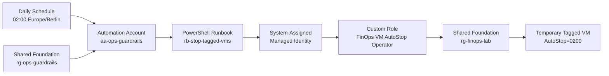
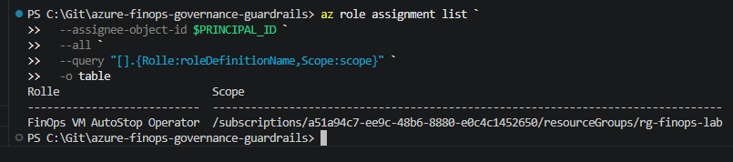
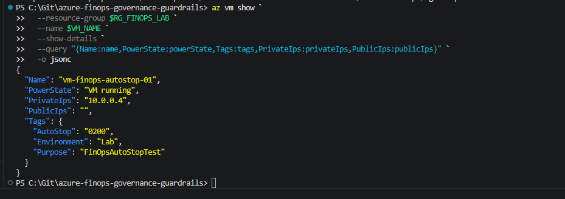
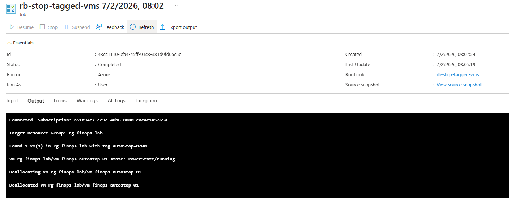
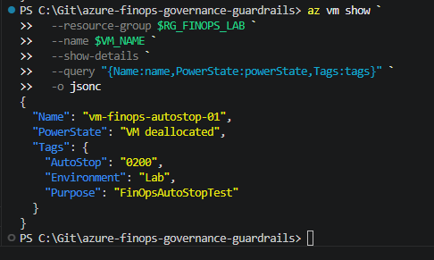
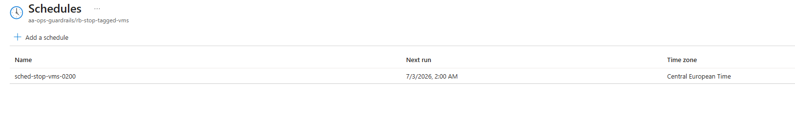

# Module 02 — Nightly VM Auto-Stop

## Tag-Based FinOps Guardrail with Least-Privilege RBAC

This module automatically deallocates Azure virtual machines based on an operational tag.

The goal is not only to build a working cost-control automation, but to maintain it as a reproducible and auditable governance control using Managed Identity, scoped RBAC, custom roles, explicit ownership boundaries, and proof-based validation.

Module 02 consumes shared Foundation scopes but owns only its own Automation and RBAC resources.

> A tagged VM is deallocated by an Azure Automation Runbook using a system-assigned Managed Identity with a custom RBAC role scoped only to the shared FinOps lab resource group.

---

## What It Does

The guardrail:

* searches only within the shared target resource group `rg-finops-lab`
* identifies VMs with the operational tag `AutoStop=0200`
* checks the actual runtime state through `PowerState/*`
* deallocates only VMs that are currently running
* authenticates through a system-assigned Managed Identity
* uses a custom Azure RBAC role instead of a broad built-in role
* limits permissions to `rg-finops-lab`
* fails the Automation job on authentication, context, VM discovery, state, or deallocation errors
* validates the expected schedule configuration during deployment

A deallocated VM no longer consumes VM compute resources. Managed disks and other attached resources remain available until they are deleted separately.

---

## Ownership Boundary

The following Resource Groups are shared Foundation scopes and are **not owned by Module 02**:

```text
rg-ops-guardrails
rg-finops-lab
```

Module 02 must never create or delete these Resource Groups.

Module 02 owns:

* Automation Account `aa-ops-guardrails`
* Runbook `rb-stop-tagged-vms`
* Schedule `sched-stop-vms-0200`
* Runbook-to-schedule link
* custom role `FinOps VM AutoStop Operator`
* the Managed Identity role assignment for the Automation Account

The proof VM `vm-finops-autostop-01` is a **temporary E2E fixture**. It may be created for validation and deleted immediately afterwards to avoid unnecessary cost.

---

## Architecture


```mermaid
flowchart LR
    F1[Shared Foundation<br/>rg-ops-guardrails]
    F2[Shared Foundation<br/>rg-finops-lab]

    S[Daily Schedule<br/>02:00 Europe/Berlin] --> AA[Automation Account<br/>aa-ops-guardrails]
    AA --> RB[PowerShell Runbook<br/>rb-stop-tagged-vms]
    RB --> MI[System-Assigned<br/>Managed Identity]
    MI --> CR[Custom Role<br/>FinOps VM AutoStop Operator]
    CR --> F2
    F2 --> VM[Temporary Tagged VM<br/>AutoStop=0200]

    F1 --> AA
```

---

## Evolution: From Automation to Governance

| Area           | V1 — Scheduled AutoStop              | V1.1 — Custom RBAC Hardening                                   |
| -------------- | ------------------------------------ | -------------------------------------------------------------- |
| Trigger        | Daily schedule at 02:00              | Unchanged                                                      |
| Target scope   | Subscription-wide VM discovery       | Explicitly limited to `rg-finops-lab`                          |
| Identity       | System-assigned Managed Identity     | Unchanged                                                      |
| RBAC role      | `Virtual Machine Contributor`        | Custom role: `FinOps VM AutoStop Operator`                     |
| RBAC scope     | Entire subscription                  | Shared FinOps lab Resource Group only                          |
| Security model | Functional, but overly broad         | Least privilege with reduced blast radius                      |
| Validation     | Successful scheduled VM deallocation | Successful deallocation after removing the broad built-in role |

The V1.1 hardening was validated successfully: after removing the subscription-level `Virtual Machine Contributor` assignment, the runbook still deallocated the tagged VM using only the custom role assigned to `rg-finops-lab`.

---

## Brownfield Hardening — September 2026

Before Terraform migration, the live implementation was compared with the repository and repaired.

The main findings and fixes were:

* `rg-ops-guardrails` and `rg-finops-lab` are shared Foundation scopes and are preserved by deploy and cleanup logic
* the Module 02 custom role and Managed Identity role assignment had been lost and were restored
* the deploy script now reconciles an existing custom role instead of silently skipping it
* deployment validates the expected RBAC actions and assignable scope
* deployment validates the daily `02:00` schedule, `Europe/Berlin` time zone, and enabled state
* the Runbook now fails fast instead of allowing Azure errors to result in a misleading `Completed` job
* the Runbook explicitly validates that a usable subscription context exists after Managed Identity authentication
* a no-VM validation run completed successfully with a real subscription context and no Error stream
* repeated deployment was validated successfully, including the existing-role update path

This Brownfield repair is intentionally completed before Terraform import so that Terraform does not adopt a broken or ambiguous live architecture.

---

## Brownfield E2E Validation — September 2026

After the Brownfield repair, the full AutoStop flow was validated end to end:

* temporary VM `vm-finops-autostop-01` was created in `rg-finops-lab`
* the VM started in `PowerState/running` with `AutoStop=0200` and no public IP
* the runbook discovered exactly one matching VM
* the system-assigned Managed Identity authenticated with a valid subscription context
* the custom least-privilege role successfully allowed VM status inspection and deallocation
* the Automation job completed without exception or Error stream
* the VM reached `VM deallocated`
* the temporary VM, OS disk, and NIC were deleted after validation

This confirms that the repaired Module 02 control works end to end without leaving test resources behind.

---

## Why a Custom Role?

Managed Identity removes secrets from code and runbooks. It does not remove the need for least-privilege access.

The initial implementation used the built-in `Virtual Machine Contributor` role at subscription scope. That worked, but it was far broader than necessary for a VM AutoStop use case.

The runbook only requires permission to:

```json
{
  "Actions": [
    "Microsoft.Compute/virtualMachines/read",
    "Microsoft.Compute/virtualMachines/instanceView/read",
    "Microsoft.Compute/virtualMachines/deallocate/action"
  ]
}
```

This allows the automation to:

* read VM metadata and tags
* inspect VM runtime status
* deallocate running target VMs

It cannot create, resize, reconfigure, or delete VMs.

---

## Tags Used by This Module

This module uses an operational control tag:

```text
AutoStop = 0200
```

This tag is evaluated by the runbook.

It tells the automation:

> This VM is allowed to be deallocated by the nightly AutoStop guardrail.

Governance and cost-allocation tags such as `Environment`, `Project`, `CostCenter`, and `Owner` are handled by **Module 03 — Tag Governance Policy**.

---

## Components

### Control Plane

| Component          | Name                             | Ownership |
| ------------------ | -------------------------------- | --------- |
| Resource Group     | `rg-ops-guardrails`              | Shared Foundation — external to Module 02 |
| Automation Account | `aa-ops-guardrails`              | Module 02 |
| Runbook            | `rb-stop-tagged-vms`             | Module 02 |
| Schedule           | `sched-stop-vms-0200`            | Module 02 |
| Authentication     | System-assigned Managed Identity | Module 02 |

### Target Scope

| Component       | Name                                                                                                      | Ownership |
| --------------- | --------------------------------------------------------------------------------------------------------- | --------- |
| Resource Group  | `rg-finops-lab`                                                                                           | Shared Foundation — external to Module 02 |
| Proof VM        | `vm-finops-autostop-01`                                                                                   | Temporary E2E fixture |
| Operational tag | `AutoStop=0200`                                                                                           | Module 02 workload contract |
| Governance tags | `Environment=Lab`, `Project=FinOpsGuardrails`, `CostCenter=FinOpsLab`, `Owner=Manuel`                    | Foundation / Module 03 governance |
| Public IP       | None                                                                                                      | E2E fixture constraint |

---

## Runbook Logic

Runbook file: [`infra/stop-tagged-vms.ps1`](./infra/stop-tagged-vms.ps1)

The runbook performs these steps:

1. Sets terminating error behavior for the automation
2. Authenticates through `Connect-AzAccount -Identity`
3. validates that Azure returned a usable subscription context
4. retrieves VMs only from `rg-finops-lab`
5. filters VMs by `AutoStop=0200`
6. checks the VM runtime status through `Get-AzVM -Status`
7. validates `PowerState/running`
8. deallocates the VM through `Stop-AzVM -Force`
9. throws on real failures so the Azure Automation job is marked as failed

The script uses the technical status code `PowerState/running` instead of the display value `VM running`.

A healthy run with no matching VM is valid and should end with:

```text
Connected. Subscription: <subscription-id>
Target Resource Group: rg-finops-lab
Found 0 VM(s) in rg-finops-lab with tag AutoStop=0200
AutoStop guardrail completed successfully.
```

---

## Deployment Behavior

`scripts/deploy.sh` is designed to be repeatable.

It:

* validates both shared Foundation Resource Groups instead of creating them
* creates or validates the Automation Account
* enables and resolves the system-assigned Managed Identity
* creates or reconciles the custom role from the repository definition
* validates the expected role scope and required VM actions
* creates the Managed Identity role assignment if missing
* creates or updates and publishes the Runbook
* creates the schedule if missing
* validates an existing schedule against the expected configuration
* creates the Runbook-to-schedule link if missing
* preserves shared Foundation ownership boundaries

---

## Cleanup Behavior

`scripts/cleanup.sh` removes only Module 02-owned resources.

It removes, when present:

* the Managed Identity custom-role assignment at `rg-finops-lab`
* the legacy subscription-level `Virtual Machine Contributor` assignment from older V1 deployments
* the Automation Account and the contained Runbook, schedule, and job-schedule link
* the custom role definition

It explicitly preserves:

```text
rg-ops-guardrails
rg-finops-lab
```

The cleanup logic performs existence checks instead of suppressing arbitrary Azure CLI failures. A real CLI, authentication, or authorization error should stop the cleanup instead of being silently ignored.

---

## Repository Structure

```text
modules/02-nightly-vm-autostop/
├── infra/
│   ├── stop-tagged-vms.ps1
│   └── finops-vm-autostop-role.json
├── scripts/
│   ├── deploy.sh
│   └── cleanup.sh
├── proofs/
│   ├── v1-scheduled-autostop/
│   │   ├── cli/
│   │   └── screenshots/
│   └── v1.1-custom-rbac-hardening/
│       └── screenshots/
└── README.md
```

---

## Proof Artifacts

### V1 — Scheduled AutoStop

The initial working implementation, including CLI evidence and screenshots, is available here:

* [`proofs/v1-scheduled-autostop/cli`](./proofs/v1-scheduled-autostop/cli)
* [`proofs/v1-scheduled-autostop/screenshots`](./proofs/v1-scheduled-autostop/screenshots)

### V1.1 — Custom RBAC Hardening

| Step | What is proven                                                        | Screenshot                                                                                                                 |
| ---: | --------------------------------------------------------------------- | -------------------------------------------------------------------------------------------------------------------------- |
|    1 | The Managed Identity has only the custom role at Resource Group scope | [`01_custom-role-rg-scope.png`](./proofs/v1.1-custom-rbac-hardening/screenshots/01_custom-role-rg-scope.png)               |
|    2 | The tagged test VM is running and has no public IP                    | [`02_vm-before-running-tagged.png`](./proofs/v1.1-custom-rbac-hardening/screenshots/02_vm-before-running-tagged.png)       |
|    3 | The runbook successfully deallocates the VM with the custom role      | [`03_runbook-custom-role-success.png`](./proofs/v1.1-custom-rbac-hardening/screenshots/03_runbook-custom-role-success.png) |
|    4 | The VM is confirmed as deallocated after the run                      | [`04_vm-after-deallocated.png`](./proofs/v1.1-custom-rbac-hardening/screenshots/04_vm-after-deallocated.png)               |
|    5 | The runbook remains linked to the nightly 02:00 schedule              | [`05_schedule-linked-next-run.png`](./proofs/v1.1-custom-rbac-hardening/screenshots/05_schedule-linked-next-run.png)       |

### V1.1 Screenshots

#### 01 — Custom Role at Resource Group Scope



#### 02 — Running and Tagged Test VM



#### 03 — Successful Runbook Execution



#### 04 — VM Successfully Deallocated



#### 05 — Nightly Schedule Linked to the Runbook



---

## Relation to Module 03

Module 02 controls **what happens to the VM**:

```text
AutoStop=0200
        ↓
Runbook detects the VM
        ↓
Managed Identity deallocates the VM
        ↓
Custom RBAC limits the blast radius
```

Module 03 adds **governance context** to the same shared target environment:

```text
rg-finops-lab has governance tags
        ↓
Azure Policy inherits missing tags to resources
        ↓
VM receives Environment, Project, CostCenter, and Owner
        ↓
AutoStop automation still works
```

The Resource Group and its baseline governance tags belong to the shared Foundation rather than being independently owned by either Module 02 or Module 03.

Together, the modules form a stronger FinOps guardrail pattern:

```text
Governance context
+ Operational control
+ Least-privilege execution
+ Proof-based validation
```

---

## Relation to Module 05

Module 05 implements a separate event-driven governance capability for resource attribution using Azure Activity Log, Event Grid, and Azure Functions.

It complements Module 02 rather than replacing the nightly AutoStop control.

The combined environment can therefore provide both:

* scheduled cost-control automation through Module 02
* event-driven resource attribution through Module 05

---

## Key Learnings

1. **Managed Identity does not automatically mean least privilege.**
   Machine identities should receive only the permissions required for their specific task.

2. **RBAC scope matters as much as the role itself.**
   Even an appropriate role can be too broad if it is assigned at subscription scope.

3. **A working automation is not automatically a governance-ready control.**
   Scoped permissions, custom roles, validation, ownership boundaries, and proof artifacts are part of the engineering work.

4. **A successful job status is not enough evidence by itself.**
   Runbooks should use terminating errors and validate required Azure context so real failures cannot silently end as `Completed`.

5. **Resource ownership must be explicit in Brownfield environments.**
   Shared Foundation scopes must not be created or destroyed by individual child modules.

6. **Use `PowerState` codes for automation logic.**
   `PowerState/running` is more reliable for technical validation than the display value `VM running`.

7. **Operational tags and governance tags serve different purposes.**
   `AutoStop=0200` controls automation behavior.
   `Environment`, `Project`, `CostCenter`, and `Owner` describe the resource.

---

## Evolution Path

Module 02 now represents the hardened scheduled AutoStop control with explicit ownership, least-privilege RBAC, fail-fast execution, and repeatable deployment.

The next architectural step for this repository is not to add more ownership to Module 02, but to stabilize the remaining modules around the same shared Foundation model.

After the Brownfield modules have been validated together, the environment can be migrated to Terraform using explicit ownership and import boundaries.

> Started as cost automation. Evolved into a governance control. Hardened for Brownfield migration.
