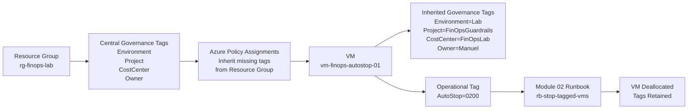
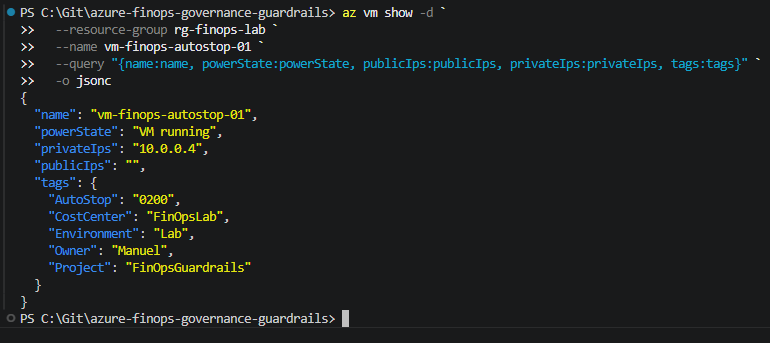
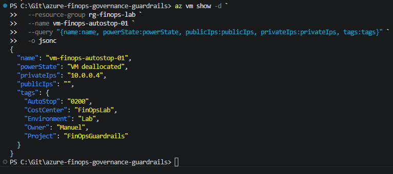

# Module 03 — Tag Governance Policy

## Azure Policy-Based Tag Inheritance for FinOps Guardrails

This module extends the FinOps Guardrails Evolution by adding automated tag governance to the dedicated FinOps lab resource group.

Module 02 introduced a least-privilege AutoStop guardrail: a system-assigned Managed Identity uses a custom RBAC role on Resource Group scope to deallocate virtual machines tagged with `AutoStop=0200`.

Module 03 adds the next governance layer: resources inside `rg-finops-lab` automatically inherit standard governance tags from the Resource Group using Azure Policy.

This module represents **Part 2** of the FinOps Guardrails Evolution:

> A VM is not only controlled by an AutoStop guardrail, but also automatically classified with governance tags for environment, project, cost allocation, and ownership.

---

## What It Does

This module:

* creates or updates the dedicated lab resource group `rg-finops-lab`
* applies central governance tags to the Resource Group
* assigns Azure Policy definitions to inherit missing tags from the Resource Group
* uses system-assigned Managed Identities for the policy assignments
* grants the policy identities `Tag Contributor` only on `rg-finops-lab`
* validates the tagging behavior with the AutoStop VM scenario from Module 02

---

## Governance Tags

The following tags are applied centrally to the Resource Group:

```text
Environment = Lab
Project     = FinOpsGuardrails
CostCenter  = FinOpsLab
Owner       = Manuel
```

These tags describe the resource from a governance and cost-management perspective.

They answer questions such as:

* Which environment does this resource belong to?
* Which project does it support?
* Which cost bucket should it be associated with?
* Who is responsible for it?

---

## Operational Tag

The AutoStop automation from Module 02 uses a separate operational tag:

```text
AutoStop = 0200
```

This tag controls automation behavior.

Governance tags describe the resource.
The `AutoStop` tag controls what the runbook should do with it.

```text
Governance tags:
Environment
Project
CostCenter
Owner

Operational tag:
AutoStop
```

---

## Why This Matters

Cloud resources should not be anonymous.

A virtual machine can create cost, operational responsibility, and security impact. Without tags, it becomes harder to understand what a resource belongs to, who owns it, and which controls should apply.

This module separates two concerns:

```text
Governance context
        ↓
Environment, Project, CostCenter, Owner

Operational control
        ↓
AutoStop=0200
```

This makes the resource both understandable and controllable.

---

## Relation to Module 02

Module 02 controls **what happens to the VM**:

```text
AutoStop=0200
        ↓
Runbook detects the VM
        ↓
Managed Identity deallocates the VM
        ↓
Custom RBAC limits the blast radius
```

Module 03 adds **governance context** to the same target environment:

```text
rg-finops-lab has governance tags
        ↓
Azure Policy inherits missing tags to resources
        ↓
VM receives Environment, Project, CostCenter, and Owner
        ↓
AutoStop automation still works
```

Together, both modules form a stronger FinOps guardrail pattern:

```text
Governance context
+ Operational control
+ Least-privilege execution
+ Proof-based validation
```

---

## Architecture



---

## Components

### Target Resource Group

| Component      | Name                |
| -------------- | ------------------- |
| Resource Group | `rg-finops-lab`     |
| Location       | `westeurope`        |

### Governance Tags

| Tag          | Value               | Purpose                       |
| ------------ | ------------------- | ----------------------------- |
| `Environment` | `Lab`             | Environment classification    |
| `Project`     | `FinOpsGuardrails` | Project assignment            |
| `CostCenter`  | `FinOpsLab`       | Cost allocation               |
| `Owner`       | `Manuel`          | Responsibility / ownership    |

### Policy Assignments

| Assignment Name           | Purpose                                                 |
| ------------------------- | ------------------------------------------------------- |
| `inherit-environment-tag` | Inherits the `Environment` tag from the Resource Group   |
| `inherit-project-tag`     | Inherits the `Project` tag from the Resource Group       |
| `inherit-costcenter-tag`  | Inherits the `CostCenter` tag from the Resource Group    |
| `inherit-owner-tag`       | Inherits the `Owner` tag from the Resource Group         |

Each policy assignment uses a system-assigned Managed Identity.

The policy identities are granted:

```text
Tag Contributor
```

only on:

```text
/subscriptions/<subscription-id>/resourceGroups/rg-finops-lab
```

---

## Proof Scenario

The proof builds on the Module 02 AutoStop scenario.

1. `rg-finops-lab` has central governance tags
2. Azure Policy assignments inherit missing tags from the Resource Group
3. VM `vm-finops-autostop-01` is created with the operational tag `AutoStop=0200`
4. The VM automatically receives the governance tags
5. The VM has no public IP
6. The Module 02 AutoStop runbook deallocates the VM
7. The VM remains tagged after deallocation

The proof demonstrates that governance tagging and operational automation can work together.

---

## Proof Artifacts

### CLI Evidence

| Step | What is proven | Artifact |
| ---: | -------------- | -------- |
| 1 | Resource Group has central governance tags | [`01_rg-tags.jsonc`](./proofs/cli/01_rg-tags.jsonc) |
| 2 | Azure Policy assignments exist | [`02_policy-assignments.jsonc`](./proofs/cli/02_policy-assignments.jsonc) |
| 3 | VM is running, has no public IP, and inherited governance tags | [`03_vm-before-running-no-public-ip-inherited-tags.jsonc`](./proofs/cli/03_vm-before-running-no-public-ip-inherited-tags.jsonc) |

### Screenshots

| Step | What is proven | Screenshot |
| ---: | -------------- | ---------- |
| 1 | VM is running, has no public IP, has `AutoStop=0200`, and inherited governance tags | [`01_vm-running-no-public-ip-inherited-tags.png`](./proofs/screenshots/01_vm-running-no-public-ip-inherited-tags.png) |
| 2 | VM is deallocated and all tags are retained | [`02_vm-deallocated-tags-retained.png`](./proofs/screenshots/02_vm-deallocated-tags-retained.png) |

### 01 — VM Running with No Public IP and Inherited Tags



### 02 — VM Deallocated with Tags Retained



---

## Deployment

Run from the repository root using Git Bash:

```bash
bash modules/03-tag-governance-policy/scripts/deploy.sh
```

Or from PowerShell:

```powershell
& "C:\Program Files\Git\bin\bash.exe" ".\modules\03-tag-governance-policy\scripts\deploy.sh"
```

The deployment script:

* creates or updates `rg-finops-lab`
* applies central governance tags to the Resource Group
* creates Azure Policy assignments for tag inheritance
* enables system-assigned Managed Identities on the assignments
* grants `Tag Contributor` on Resource Group scope

---

## Repository Structure

```text
modules/03-tag-governance-policy/
├── proofs/
│   ├── cli/
│   │   ├── 01_rg-tags.jsonc
│   │   ├── 02_policy-assignments.jsonc
│   │   └── 03_vm-before-running-no-public-ip-inherited-tags.jsonc
│   └── screenshots/
│       ├── 01_vm-running-no-public-ip-inherited-tags.png
│       └── 02_vm-deallocated-tags-retained.png
├── scripts/
│   └── deploy.sh
└── README.md
```

---

## Key Learnings

1. **Tags can separate governance context from automation behavior.**
   `Environment`, `Project`, `CostCenter`, and `Owner` describe the resource.
   `AutoStop=0200` controls automation behavior.

2. **Tag governance becomes more valuable as environments grow.**
   In a single lab, tags look simple. Across Lab, Dev, Prod, multiple projects, owners, and cost centers, they become essential.

3. **Azure Policy can make governance automatic.**
   Instead of relying on manual tagging, missing tags can be inherited from the Resource Group.

4. **Guardrails work best together.**
   Module 02 controls runtime cost. Module 03 adds resource context and accountability.

5. **Governance should be validated with realistic scenarios.**
   The final proof does not use an isolated test resource. It builds on the existing AutoStop VM scenario from Module 02.

---

## Next Evolution

The next step is to move from inherited static governance tags toward more dynamic accountability:

* Azure Activity Log
* Event Grid
* Azure Functions or Durable Functions
* automatic `CreatedBy` tagging
* person-based resource ownership tracking

This would allow resources to be tagged not only by project or owner, but also by the identity that created them.

> Module 02 controls what happens to the VM.
> Module 03 explains what the VM belongs to.
