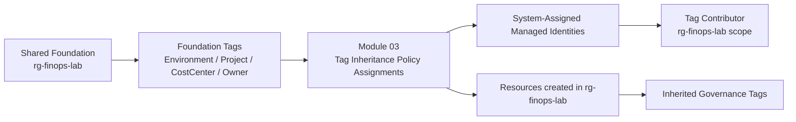

# Module 03 — Tag Governance Policy

## Azure Policy-Based Tag Inheritance for FinOps Guardrails

Module 03 applies tag inheritance guardrails to the shared FinOps lab scope. Resources created in `rg-finops-lab` inherit missing governance tags from the Resource Group through Azure Policy.

The module consumes the shared Foundation Resource Group and its tag values. It does **not** own, create, delete, or update the Resource Group itself.

---

## What It Does

Module 03:

* validates that shared Resource Group `rg-finops-lab` exists
* validates that the Foundation tags `Environment`, `Project`, `CostCenter`, and `Owner` exist on the Resource Group
* assigns the built-in Azure Policy `Inherit a tag from the resource group if missing`
* creates one policy assignment per governance tag
* uses a system-assigned Managed Identity on each assignment
* grants each policy identity `Tag Contributor` only on `rg-finops-lab`
* validates existing assignments semantically instead of treating existence as correctness
* fails on real Azure CLI, RBAC, identity, or configuration errors

The operational `AutoStop=0200` tag belongs to Module 02 and is intentionally separate from these governance tags.

---

## Ownership Boundary

### Shared Foundation — external to Module 03

Module 03 consumes but does not own:

```text
rg-finops-lab
├─ Environment = Lab
├─ Project = FinOpsGuardrails
├─ CostCenter = FinOpsLab
└─ Owner = Manuel
```

The Resource Group and central tag values will later be represented in a dedicated Foundation area of the repository. Until then, Module 03 treats them as external dependencies.

### Module 03 owns

```text
inherit-environment-tag
inherit-project-tag
inherit-costcenter-tag
inherit-owner-tag
```

Each assignment owns its own system-assigned Managed Identity. Module 03 also owns the corresponding `Tag Contributor` role assignment for that identity at `rg-finops-lab` scope.

The built-in Azure Policy definition itself is Microsoft-owned and is not created or deleted by this module.

---

## Policy Assignments

| Assignment | Inherited tag |
| --- | --- |
| `inherit-environment-tag` | `Environment` |
| `inherit-project-tag` | `Project` |
| `inherit-costcenter-tag` | `CostCenter` |
| `inherit-owner-tag` | `Owner` |

All four assignments use:

```text
Policy: Inherit a tag from the resource group if missing
Identity: SystemAssigned
Location: westeurope
EnforcementMode: Default
RBAC: Tag Contributor
Scope: /subscriptions/<subscription-id>/resourceGroups/rg-finops-lab
```

---

## Architecture


```mermaid
flowchart LR
    F[Shared Foundation<br/>rg-finops-lab] --> T[Foundation Tags<br/>Environment / Project / CostCenter / Owner]
    T --> P[Module 03<br/>Tag Inheritance Policy Assignments]
    P --> MI[System-Assigned Managed Identities]
    MI --> RBAC[Tag Contributor<br/>rg-finops-lab scope]
    P --> R[Resources created in rg-finops-lab]
    R --> IT[Inherited Governance Tags]
```

---

## Brownfield Hardening — September 2026

Before Terraform migration, the live implementation was compared with the repository.

The live state was healthy:

* all four expected Foundation tags existed on `rg-finops-lab`
* all four Module 03 policy assignments existed
* each assignment referenced the expected built-in policy definition
* each assignment used the correct `tagName`
* all four assignments had a system-assigned Managed Identity
* each identity had `Tag Contributor` at exactly `rg-finops-lab` scope
* `Location` was `westeurope`
* `EnforcementMode` was `Default`

The repository implementation still had ownership and reliability problems and was hardened:

* Module 03 no longer creates or updates `rg-finops-lab`
* Module 03 no longer sets Foundation tag values
* shared Foundation dependencies are validated instead of silently created
* existing policy assignments are checked for semantic drift
* RBAC is explicitly checked and confirmed
* broad `2>/dev/null || true` error swallowing was removed
* deployment is repeatable against an already-correct live environment
* cleanup is ownership-aware and preserves the shared Foundation

This prevents Terraform from later importing an ambiguous ownership model.

---

## E2E Validation — 23 September 2026

A temporary Storage Account was created in `rg-finops-lab` without supplying governance tags.

After creation, the resource contained:

```text
Environment = Lab
Project = FinOpsGuardrails
CostCenter = FinOpsLab
Owner = Manuel
```

This proves the complete Module 03 path:

```text
Resource created without governance tags
        ↓
Azure Policy assignments evaluate the resource
        ↓
Managed Identities apply the modify effect
        ↓
Missing governance tags are inherited from rg-finops-lab
```

The test resource also received `CreatedAt`, `CreatedBy`, and `CreatedByType`. Those attribution tags are produced by the separate event-driven attribution module and are not owned by Module 03.

---

## Deployment

From the repository root:

```bash
bash modules/03-tag-governance-policy/scripts/deploy.sh
```

From PowerShell:

```powershell
& "C:\Program Files\Git\bin\bash.exe" ".\modules\03-tag-governance-policy\scripts\deploy.sh"
```

The deployment script:

1. resolves the active subscription
2. validates the shared Foundation Resource Group
3. validates that all four required Foundation tag names have values
4. resolves the Microsoft built-in inheritance policy
5. creates missing Module 03 assignments
6. semantically validates existing assignments
7. resolves each policy Managed Identity
8. creates missing `Tag Contributor` RBAC at the exact lab scope
9. confirms RBAC after creation or discovery
10. prints the resulting Module 03 policy state

A configuration mismatch is treated as drift and stops the deployment instead of being silently overwritten.

---

## Cleanup

```bash
bash modules/03-tag-governance-policy/scripts/cleanup.sh
```

Cleanup removes only Module 03-owned resources:

* the four exact `Tag Contributor` assignments belonging to the policy identities
* the four Module 03 policy assignments and their system-assigned identities

Cleanup explicitly preserves:

```text
rg-finops-lab
Foundation governance tags
Module 04 policy assignments
Microsoft built-in policy definitions
other resources in the shared Resource Group
```

The cleanup script performs explicit existence checks and does not suppress arbitrary Azure CLI failures.

---

## Relation to Other Modules

Module 02 uses the operational tag:

```text
AutoStop=0200
```

to control VM deallocation.

Module 03 provides governance context:

```text
Environment
Project
CostCenter
Owner
```

Module 04 adds the broader Azure Policy baseline at the same shared lab scope.

Module 05 adds event-driven resource attribution such as `CreatedBy`, `CreatedByType`, and `CreatedAt`.

The modules share a target environment but retain separate ownership boundaries.

---

## Repository Structure

```text
modules/03-tag-governance-policy/
├── proofs/
│   ├── cli/
│   └── screenshots/
├── scripts/
│   ├── deploy.sh
│   └── cleanup.sh
└── README.md
```

The existing proof artifacts from the original implementation remain in `proofs/`.

---

## Terraform Migration Classification

For the later Brownfield Terraform migration:

| Resource | Classification |
| --- | --- |
| `rg-finops-lab` | Foundation — IMPORT outside Module 03 |
| Foundation governance tag values | Foundation ownership |
| four tag inheritance policy assignments | Module 03 — IMPORT |
| four policy system-assigned identities | Managed through policy assignments |
| four `Tag Contributor` assignments | Module 03 — IMPORT |
| Microsoft built-in policy definition | EXTERNAL |

Terraform migration starts only after the remaining Brownfield modules and the shared Foundation ownership model have been stabilized.
