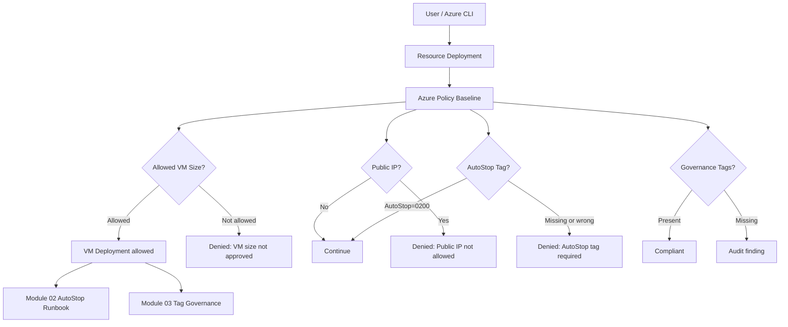

# Module 04 — Policy Baseline

Preventive Azure Policy guardrails for lab environments.

This module is part of my **FinOps Guardrails Evolution** series.

In this series, I show how I improve my Azure cost control step by step by combining monitoring, automation, tagging, and preventive governance.

## Evolution Context

The previous modules focused on visibility, automation, and accountability:

- **Module 01:** Budget Alerts — detect cost thresholds early
- **Module 02:** Nightly VM Auto-Stop — automatically stop tagged VMs with least privilege
- **Module 03:** Tag Governance Policy — automatically inherit governance tags from the resource group
- **Module 04:** Policy Baseline — prevent risky or expensive resources from being created

The key idea of this module:

> Do not only react when costs already exist.  
> Prevent unnecessary cost risks before resources are created.

## What This Module Does

This module creates a small Azure Policy baseline for the lab resource group.

The baseline includes:

- allowed VM sizes
- denied public IP addresses
- required AutoStop tag on VMs
- audited governance tags

The policies are assigned at the scope of the lab resource group:

```text
rg-finops-lab
```

## Guardrails

| Guardrail | Effect | Purpose |
|---|---:|---|
| Allow only approved VM sizes | Deny | Prevent oversized or expensive VMs in the lab |
| Deny public IP addresses | Deny | Avoid unnecessary public exposure |
| Require AutoStop tag on lab VMs | Deny | Ensure VMs can be handled by the AutoStop automation |
| Audit missing governance tags | Audit | Detect resources without required cost and ownership metadata |

## Allowed VM Sizes

For this lab, only small VM sizes are allowed:

```text
Standard_B1s
Standard_B2s
```

Everything else is denied by policy.

This is intentional.

A lab environment should allow learning and testing, but it should not allow accidental cost explosions.

## Extreme VM Size Test

For the proof run, I intentionally tested an oversized VM deployment:

```text
Standard_M416ms_v2
```

The result:

```text
RequestDisallowedByPolicy
```

The deployment was blocked by the policy:

```text
finops-allowed-vm-sizes
```

The evaluated policy expression showed:

```text
expression: Microsoft.Compute/virtualMachines/sku.name
expressionValue: Standard_M416ms_v2
targetValue:
  - Standard_B1s
  - Standard_B2s
operator: NotIn
effect: Deny
```

The verification confirmed that no VM resource was created:

```json
[]
```

This is the difference between reactive and preventive FinOps:

- reactive: notice the cost later
- preventive: block the risky resource before it exists

## AutoStop Tag Requirement

Module 02 introduced the operational tag:

```text
AutoStop=0200
```

This tag is used by the Automation Runbook to deallocate VMs.

Module 04 now makes this operational requirement enforceable.

A VM without the required AutoStop tag is denied.

Proof result:

```text
RequestDisallowedByPolicy
```

Policy:

```text
finops-require-vm-autostop
```

This ensures that newly created lab VMs can be picked up by the AutoStop process.

## Public IP Deny

The policy baseline also denies public IP resources in the lab.

Policy:

```text
finops-deny-public-ip
```

Reason:

A small lab environment should not expose resources publicly unless there is a specific and reviewed reason.

This guardrail reduces unnecessary attack surface and avoids accidental public exposure.

## Governance Tag Audit

Module 03 introduced inherited governance tags:

```text
Environment=Lab
Project=FinOpsGuardrails
CostCenter=FinOpsLab
Owner=Manuel
```

Module 04 adds an audit policy for missing governance tags.

This does not block deployments by default.

Instead, it helps detect resources that are missing important cost and ownership metadata.

## How the Modules Work Together

```text
Module 01:
Budget alerts detect cost thresholds.

Module 02:
VMs with AutoStop=0200 are automatically deallocated.

Module 03:
Resources inherit governance tags from the resource group.

Module 04:
Risky resources are blocked before they are created.
```

In short:

```text
In short:

Part 1: The VM is automatically stopped.
Part 2: The VM becomes organizationally and financially attributable.
Part 3: Expensive or risky resources are prevented from being created in the first place.
```

## Architecture



## Deployment

Run from the repository root using Git Bash:

```bash
bash modules/04-policy-baseline/scripts/deploy.sh
```

Or from PowerShell:

```powershell
& "C:\Program Files\Git\bin\bash.exe" ".\modules\04-policy-baseline\scripts\deploy.sh"
```

## Proof Artifacts

### CLI Proofs

| File | Description |
|---|---|
| [proofs/cli/01_rg-tags.jsonc](proofs/cli/01_rg-tags.jsonc) | Shows governance tags on the lab resource group |
| [proofs/cli/02_policy-definitions.jsonc](proofs/cli/02_policy-definitions.jsonc) | Shows created custom policy definitions |
| [proofs/cli/03_policy-assignments.jsonc](proofs/cli/03_policy-assignments.jsonc) | Shows policy assignments at resource group scope |
| [proofs/cli/04_vm-allowed-b1s-autostop-no-public-ip.jsonc](proofs/cli/04_vm-allowed-b1s-autostop-no-public-ip.jsonc) | Shows an allowed VM with approved size, no public IP, AutoStop tag, and inherited governance tags |
| [proofs/cli/05_deny-vm-without-autostop.txt](proofs/cli/05_deny-vm-without-autostop.txt) | Shows VM deployment denied because the AutoStop tag is missing |
| [proofs/cli/05b_verify-no-autostop-vm-not-created.jsonc](proofs/cli/05b_verify-no-autostop-vm-not-created.jsonc) | Verifies that the denied VM was not created |
| [proofs/cli/06_deny-vm-extreme-size.txt](proofs/cli/06_deny-vm-extreme-size.txt) | Shows oversized VM deployment denied by the allowed VM size policy |
| [proofs/cli/06b_verify-extreme-size-vm-not-created.jsonc](proofs/cli/06b_verify-extreme-size-vm-not-created.jsonc) | Verifies that the denied oversized VM was not created |
| [proofs/cli/06c_deny-vm-extreme-size-filtered.txt](proofs/cli/06c_deny-vm-extreme-size-filtered.txt) | Filtered output of the extreme VM size policy violation |
| [proofs/cli/07_deny-public-ip.txt](proofs/cli/07_deny-public-ip.txt) | Shows public IP creation denied by policy |
| [proofs/cli/07b_verify-public-ip-not-created.jsonc](proofs/cli/07b_verify-public-ip-not-created.jsonc) | Verifies that the denied public IP was not created |

### Screenshot Proofs

| File | Description |
|---|---|
| [proofs/screenshots/01_policy-baseline-deployment-success-rg-tags_subid-blurred.png](proofs/screenshots/01_policy-baseline-deployment-success-rg-tags_subid-blurred.png) | Deployment success and resource group tags |
| [proofs/screenshots/02_policy-assignments-created.png](proofs/screenshots/02_policy-assignments-created.png) | Policy assignments created |
| [proofs/screenshots/03_vm-allowed-b1s-autostop-no-public-ip.png](proofs/screenshots/03_vm-allowed-b1s-autostop-no-public-ip.png) | Allowed VM proof |
| [proofs/screenshots/04_attempt-create-vm-without-autostop-tag.png](proofs/screenshots/04_attempt-create-vm-without-autostop-tag.png) | Attempted VM deployment without AutoStop tag |
| [proofs/screenshots/05_deny-vm-without-autostop-tag-short.png](proofs/screenshots/05_deny-vm-without-autostop-tag-short.png) | Deny proof for missing AutoStop tag |
| [proofs/screenshots/06_deny-vm-without-autostop-tag-details_no-subid.png](proofs/screenshots/06_deny-vm-without-autostop-tag-details_no-subid.png) | Detailed AutoStop policy deny proof |
| [proofs/screenshots/07_deny-extreme-vm-size-policy_subid-redacted.png](proofs/screenshots/07_deny-extreme-vm-size-policy_subid-redacted.png) | Extreme VM size deny proof |
## Key Learnings

- Azure Policy is a strong preventive control for lab and sandbox environments.
- Allow lists are useful when only a small set of safe resource configurations should be permitted.
- Cost governance should not rely only on alerts and reports.
- Tags provide context, but policies enforce rules.
- Deny effects should be used carefully and tested in controlled scopes before broader rollout.
- Preventive guardrails help reduce cost risk before resources exist.

## Result

This module turns the lab from a reactive environment into a more controlled and preventive one.

Instead of only asking:

```text
Why did this resource cost money?
```

the environment can now also answer:

```text
Should this resource be allowed to exist here at all?
```

That is the core idea of this module.

