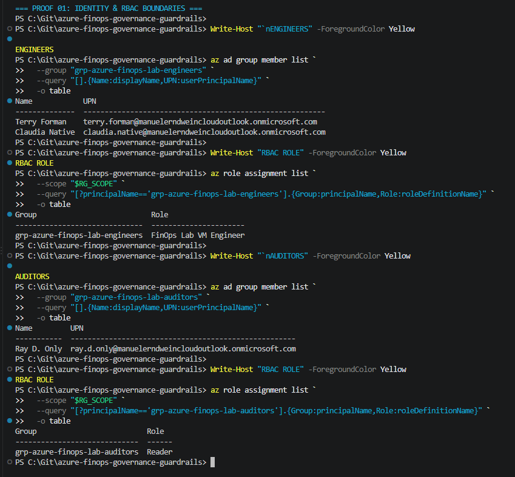
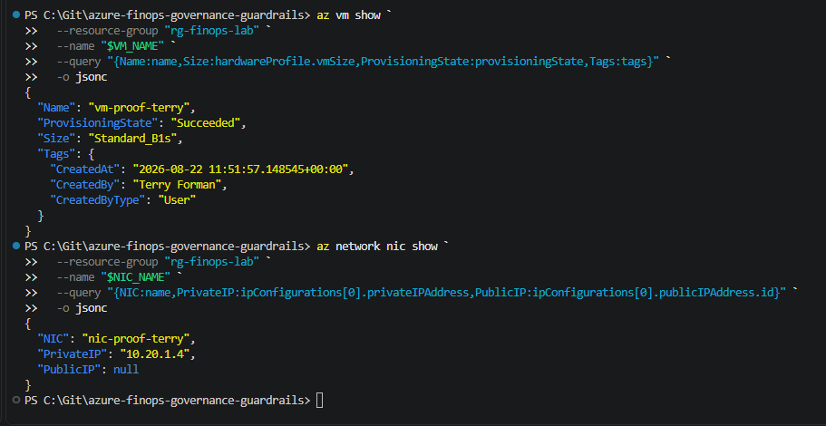
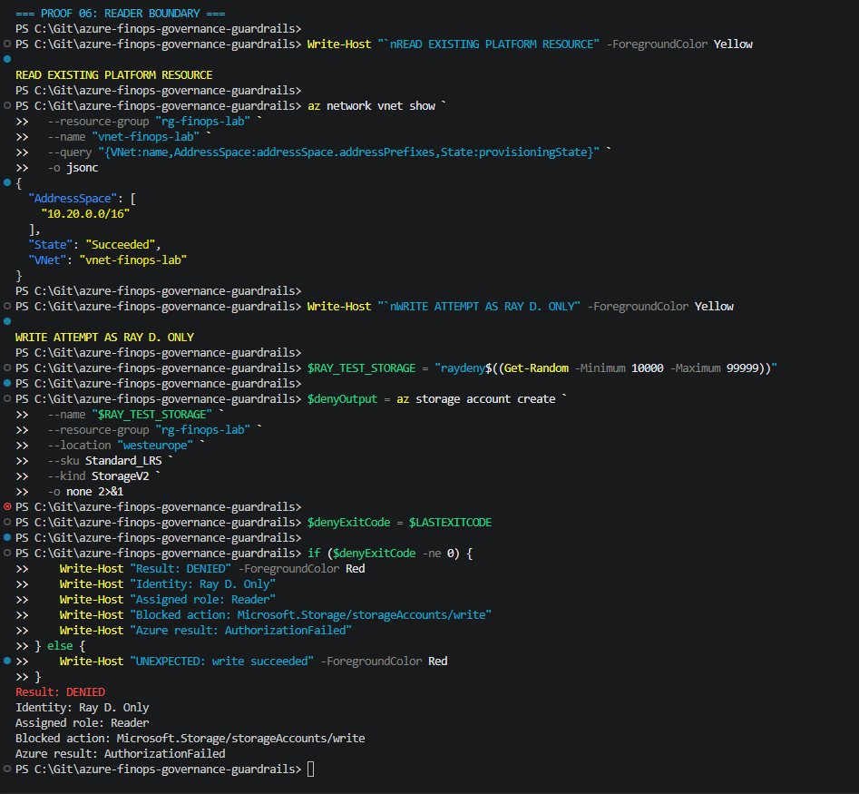
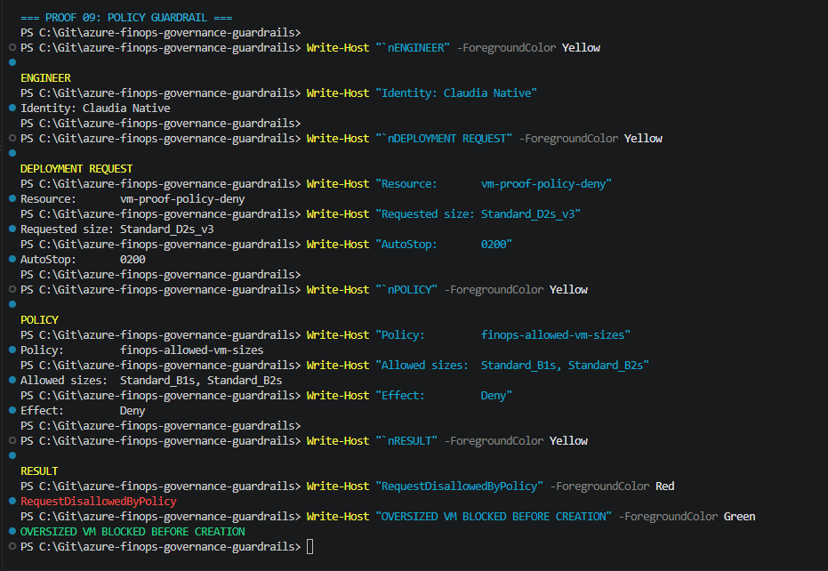
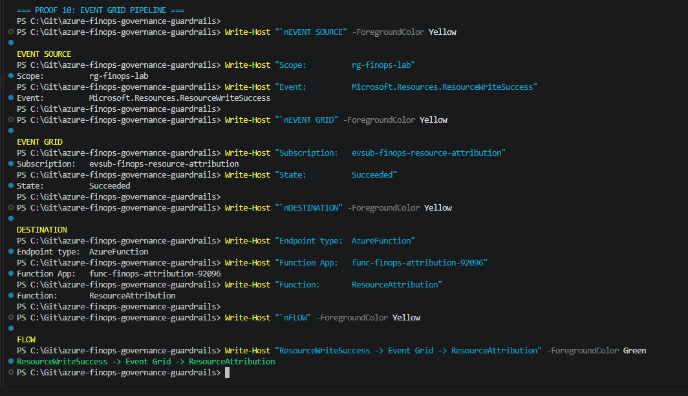
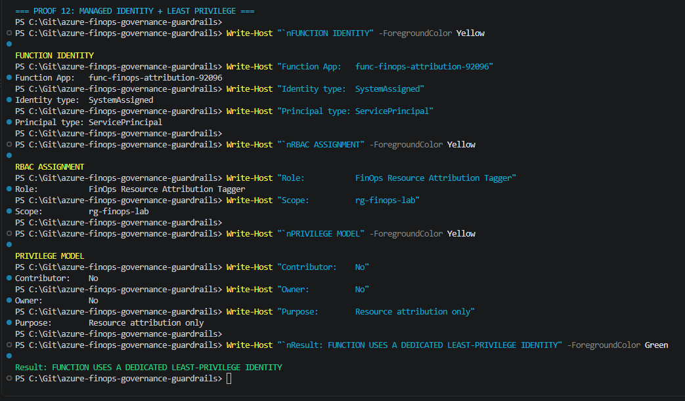
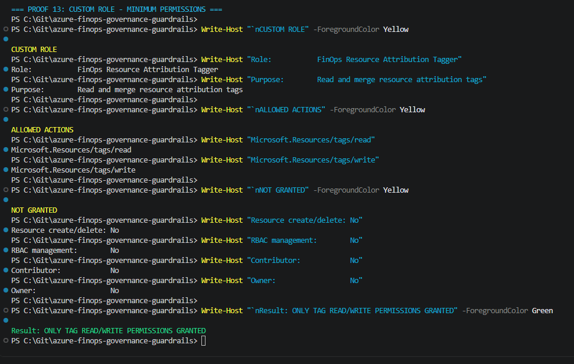
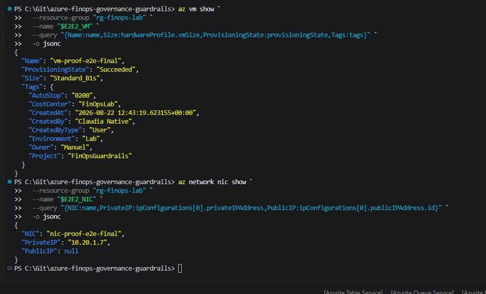
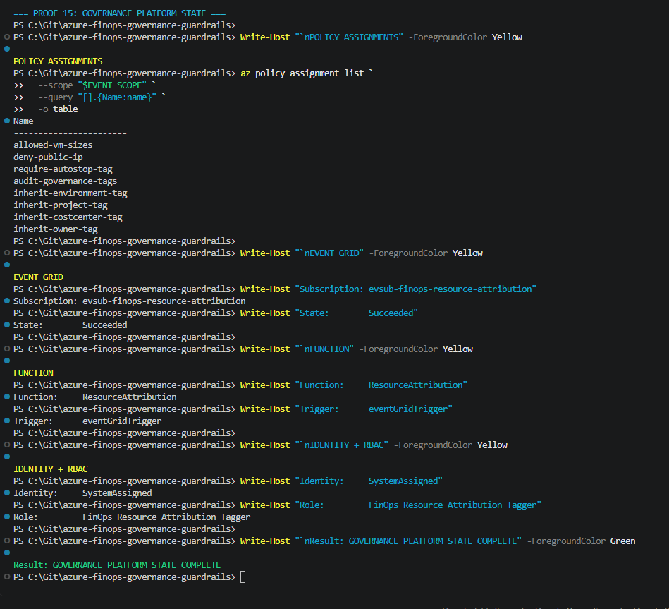

# Module 05 - Event-Driven Resource Attribution

## Status

**Completed**

Module 05 extends the FinOps governance platform with event-driven resource attribution and validates the complete control chain in Azure.

The final implementation combines:

- Microsoft Entra ID identities and security groups
- Group-based Azure RBAC
- Custom least-privilege workload permissions
- Platform / workload separation
- Azure Policy guardrails
- Central governance tag inheritance
- Azure Activity Log events
- Azure Event Grid
- Azure Functions
- Managed Identity
- Custom least-privilege tagging permissions
- Automatic creator attribution
- End-to-end validation using real Azure resources

---

## Goal

Automatically attribute newly created Azure resources to the identity that created them while keeping workload identities inside clearly defined governance boundaries.

Dynamic attribution tags:

- `CreatedBy`
- `CreatedByType`
- `CreatedAt`

Central governance tags:

- `Environment`
- `Project`
- `CostCenter`
- `Owner`

Operational workload tag:

- `AutoStop`

The result is a resource that carries both organizational governance metadata and automatically generated creator attribution.

---

## Final Architecture

```text
Microsoft Entra ID
        |
        v
Security Groups
        |
        v
Group-Based Azure RBAC
        |
        v
Custom Least-Privilege Engineer Role
        |
        v
Azure Policy Guardrails
        |
        v
Resource Creation
        |
        +-------------------------------+
        |                               |
        v                               v
Azure Policy Modify              Activity Log
        |                               |
        v                               v
Governance Tags              ResourceWriteSuccess
        |                               |
        |                               v
        |                          Event Grid
        |                               |
        |                               v
        |                         Azure Function
        |                               |
        |                               v
        |                       Managed Identity
        |                               |
        |                               v
        |                  Least-Privilege Tagger Role
        |                               |
        +---------------+---------------+
                        |
                        v
                  Azure Resource
                        |
        +---------------+----------------+
        |                                |
        v                                v
Governance Tags                  Attribution Tags

Environment                     CreatedBy
Project                         CreatedByType
CostCenter                      CreatedAt
Owner

                        +
                   AutoStop Tag
                        +
                   No Public IP
```

The architecture deliberately separates authorization, preventive governance, organizational metadata and dynamic attribution.

---

## Governance Model

Module 05 combines several independent control layers.

```text
Entra ID
Identity
        |
        v
Azure RBAC
Who may perform the action?
        |
        v
Azure Policy
Is the requested resource allowed?
        |
        v
Activity Log
What happened and who initiated it?
        |
        v
Event Grid
React to successful resource writes
        |
        v
Azure Function
Determine creator identity
        |
        v
Resource Tags
Persist attribution metadata
```

Each layer has a different responsibility.

RBAC does not replace Policy.

Policy does not replace attribution.

Attribution does not grant permissions.

This keeps the governance model explicit and reduces dependence on a single control mechanism.

---

## Identity Model

Access to the lab environment is assigned through Microsoft Entra ID security groups rather than directly to individual users.

### Engineers

Security group:

`grp-azure-finops-lab-engineers`

The engineers group receives the custom Azure RBAC role:

`FinOps Lab VM Engineer`

Engineers can deploy and manage approved workload resources without receiving broad `Contributor` access.

Multiple engineer identities were used during validation to prove that attribution is based on the actual caller rather than a hard-coded identity.

### Readers / Auditors

Read-only identities receive the built-in Azure `Reader` role on the lab resource group.

They can inspect existing platform resources but cannot create or modify workload resources.

---

## Group-Based RBAC Model

```text
Engineer Identity
        |
        v
grp-azure-finops-lab-engineers
        |
        v
FinOps Lab VM Engineer
        |
        v
rg-finops-lab


Reader Identity
        |
        v
Reader
        |
        v
rg-finops-lab
```

RBAC assignments are attached to groups wherever appropriate instead of maintaining workload permissions individually for every engineer.

---

## Separation of Duties

Platform infrastructure and workload infrastructure are deliberately separated.

### Platform / Admin Responsibilities

The platform administrator controls:

- Virtual Networks
- Subnets
- Azure RBAC
- Custom Role Definitions
- Azure Policy
- Governance infrastructure
- Event Grid integration
- Azure Function infrastructure
- Shared platform components

### Engineer Responsibilities

Engineers can:

- Deploy permitted virtual machines
- Read virtual machines
- Start virtual machines
- Restart virtual machines
- Deallocate virtual machines
- Delete permitted virtual machines
- Create and manage permitted managed disks
- Create and manage network interfaces
- Attach network interfaces to virtual machines
- Read existing VNets
- Read existing subnets
- Join existing subnets

Engineers cannot manage the lifecycle of the underlying platform VNet.

The VNet and subnet are provisioned by the platform layer and consumed by workload engineers.

This reduces the blast radius of workload identities.

---

## Platform Networking Model

The validation environment uses a platform-managed network:

```text
vnet-finops-lab
10.20.0.0/16
        |
        +-- subnet-workload
            10.20.1.0/24
```

The VNet and subnet are created by the platform administrator.

Workload engineers can consume the existing subnet without receiving VNet lifecycle permissions.

This boundary was explicitly tested by attempting to delete the platform VNet using an engineer identity.

Azure returned:

```text
AuthorizationFailed

Microsoft.Network/virtualNetworks/delete
```

The engineer could therefore deploy workload resources into the network but could not destroy the underlying platform network.

---

## Custom Workload RBAC Role

Role definition:

`infra/finops-lab-vm-engineer.role.json`

Role name:

`FinOps Lab VM Engineer`

The role was developed using an iterative least-privilege approach.

Instead of assigning the built-in `Contributor` role, permissions were derived from the actual workload deployment path.

The validation cycle was:

```text
Restricted Custom Role
        |
        v
Deployment Attempt
        |
        v
Authorization Failure
        |
        v
Identify Required Action
        |
        v
Add Only Required Permission
        |
        v
Retry
```

Examples of permissions discovered during validation included:

```text
Microsoft.Resources/deployments/write
Microsoft.Resources/deployments/read
Microsoft.Resources/deployments/operationstatuses/read

Microsoft.Network/networkInterfaces/join/action
Microsoft.Network/virtualNetworks/subnets/join/action
```

This produces a substantially smaller permission surface than assigning broad `Contributor` access.

---

## Reader Boundary Validation

A dedicated read-only identity was used to verify the opposite side of the authorization model.

Validated behavior:

- Authentication successful
- Existing platform resources readable
- Existing VNet readable
- Resource creation denied

A storage account creation attempt failed with:

```text
AuthorizationFailed

Microsoft.Storage/storageAccounts/write
```

This confirms that `Reader` provides visibility without workload modification rights.

---

## Azure Policy Guardrails

The lab uses preventive Azure Policy controls including:

| Guardrail | Effect |
|---|---|
| Approved VM sizes | Deny |
| Public IP addresses | Deny |
| Required `AutoStop` tag | Deny |
| Governance tag presence | Audit |
| `Environment` inheritance | Modify |
| `Project` inheritance | Modify |
| `CostCenter` inheritance | Modify |
| `Owner` inheritance | Modify |

The final active policy assignments were:

```text
allowed-vm-sizes
deny-public-ip
require-autostop-tag
audit-governance-tags
inherit-environment-tag
inherit-project-tag
inherit-costcenter-tag
inherit-owner-tag
```

### VM Size Enforcement

Approved lab VM sizes:

```text
Standard_B1s
Standard_B2s
```

A deployment using:

```text
Standard_D2s_v3
```

was explicitly tested.

Azure rejected the resource with:

```text
RequestDisallowedByPolicy
```

The policy evaluation showed that `Standard_D2s_v3` was not contained in the approved VM size list.

This proves that successful RBAC authorization does not allow engineers to bypass platform policy.

---

## Central Governance Tags

The resource group acts as the central source for organizational governance metadata.

Resource group:

`rg-finops-lab`

Central tags:

```text
CostCenter  = FinOpsLab
Environment = Lab
Owner       = Manuel
Project     = FinOpsGuardrails
```

Azure Policy `Modify` assignments inherit these tags onto resources when they are missing.

This separates organizational metadata from dynamic creator attribution.

---

## Event-Driven Attribution Pipeline

The core feature of Module 05 is the event-driven attribution pipeline.

```text
Engineer
        |
        v
Create Azure Resource
        |
        v
Microsoft.Resources.ResourceWriteSuccess
        |
        v
Azure Event Grid
        |
        v
ResourceAttribution Function
        |
        v
Extract Caller Information
        |
        v
Managed Identity
        |
        v
Merge Attribution Tags
        |
        v
CreatedBy
CreatedByType
CreatedAt
```

The Event Grid subscription listens for:

```text
Microsoft.Resources.ResourceWriteSuccess
```

and forwards matching events to:

```text
ResourceAttribution
```

The Function extracts the creator identity and persists the attribution directly on the created resource.

---

## Event Grid Integration

Event subscription:

`evsub-finops-resource-attribution`

Destination:

`ResourceAttribution`

Endpoint type:

`AzureFunction`

Included event type:

```text
Microsoft.Resources.ResourceWriteSuccess
```

The deployed Event Grid subscription reached:

```text
ProvisioningState: Succeeded
```

This connects successful Azure resource writes to the attribution engine without polling.

---

## Azure Function

Function App:

`func-finops-attribution-92096`

Function:

`ResourceAttribution`

Language:

`Python`

Trigger:

`eventGridTrigger`

The deployed Function receives Azure Event Grid events and processes resource attribution automatically.

The implementation extracts:

- Resource ID
- Operation
- Creator identity
- Creator identity type
- Creation timestamp

The Function then merges the resulting attribution tags onto the target resource.

---

## Function Identity and Least Privilege

The Azure Function uses a dedicated system-assigned Managed Identity.

It does not operate using engineer credentials or a broadly privileged deployment identity.

Custom role:

`FinOps Resource Attribution Tagger`

The role contains only:

```text
Microsoft.Resources/tags/read
Microsoft.Resources/tags/write
```

The role is scoped to:

`rg-finops-lab`

This allows the Function to read and merge resource tags without granting broad resource-management permissions.

The result is a dedicated automation identity with a narrowly defined responsibility.

---

## Attribution Preservation

Attribution should describe who originally created the resource.

It should not silently change whenever the resource is modified later.

This behavior was explicitly validated.

Before a VM configuration update:

```text
CreatedBy      = Claudia Native
CreatedByType  = User
CreatedAt      = original creation timestamp
```

After enabling VM boot diagnostics:

```text
CreatedBy      = Claudia Native
CreatedByType  = User
CreatedAt      = original creation timestamp
```

The attribution remained unchanged.

This prevents later resource modifications from overwriting the original creator metadata.

---

## Multi-User Attribution Validation

The attribution pipeline was tested with multiple engineer identities.

Successful deployments produced identity-specific attribution such as:

```text
CreatedBy      = Terry Forman
CreatedByType  = User
```

and:

```text
CreatedBy      = Claudia Native
CreatedByType  = User
```

This demonstrates that the attribution engine derives the creator dynamically from the Azure event rather than applying a static owner value.

---

## Final End-to-End Validation

The final validation created a real Azure VM through the governed workload path.

Result:

```text
Name               vm-proof-e2e-final
Size               Standard_B1s
ProvisioningState  Succeeded

Tags:
AutoStop       = 0200
CostCenter     = FinOpsLab
CreatedAt      = 2026-08-22 12:43:19.623155+00:00
CreatedBy      = Claudia Native
CreatedByType  = User
Environment    = Lab
Owner          = Manuel
Project        = FinOpsGuardrails

Network:
Private IP     = 10.20.1.7
Public IP      = null
```

A single resource therefore demonstrated the complete governance chain:

```text
RBAC
 +
Policy
 +
Tag Governance
 +
Operational AutoStop Metadata
 +
Event Grid
 +
Azure Function
 +
Managed Identity
 +
Dynamic Attribution
 +
No Public IP
 =
Governed Azure Workload
```

---

## Proofs

All validation screenshots are stored under:

`proofs/screenshots/`

### Identity and RBAC Boundaries



### Engineer Self-Service Attribution



### Reader Boundary



### Policy Enforcement



### Event Grid Integration



### Function Managed Identity and RBAC



### Least-Privilege Tagger Role



### Final End-to-End Proof



### Final Governance Platform State



---

## Validation Summary

| Test | Expected | Result |
|---|---|---|
| Engineer reads platform VNet | Allowed | PASS |
| Engineer joins existing subnet | Allowed | PASS |
| Engineer creates approved VM | Allowed | PASS |
| Engineer deletes own workload VM | Allowed | PASS |
| Engineer deletes platform VNet | Denied | PASS |
| Reader reads platform resources | Allowed | PASS |
| Reader creates resource | Denied | PASS |
| Oversized VM deployment | Policy denied | PASS |
| VM receives public IP | No | PASS |
| VM receives `AutoStop` | Yes | PASS |
| Governance tags inherited | Yes | PASS |
| `CreatedBy` generated automatically | Yes | PASS |
| `CreatedByType` generated automatically | Yes | PASS |
| `CreatedAt` generated automatically | Yes | PASS |
| Attribution survives later update | Yes | PASS |
| Event Grid subscription active | Yes | PASS |
| Function uses dedicated Managed Identity | Yes | PASS |
| Function role limited to tag operations | Yes | PASS |

---

## Cleanup Validation

Temporary validation resources were removed after testing.

Final cleanup verification showed:

```text
VMs:   none
NICs:  none
Disks: none
```

The reusable governance platform components remain deployed while temporary proof workloads were removed.

This keeps the lab environment clean and avoids unnecessary compute and disk costs.

---

## Operational Lesson: Configuration Drift

Final end-to-end validation exposed an important infrastructure-management lesson.

The governance tag inheritance implementation already existed in Module 03, but the corresponding policy assignments were no longer present in the current Azure environment.

The intended configuration and the deployed configuration had diverged.

Redeploying the tag-governance module restored:

```text
inherit-environment-tag
inherit-project-tag
inherit-costcenter-tag
inherit-owner-tag
```

After restoration, the final E2E workload correctly received both central governance tags and event-driven creator attribution.

This demonstrates a limitation of manually orchestrated infrastructure:

```text
Deployment Scripts
        +
Documentation
        !=
Guaranteed Current State
```

A script can describe how infrastructure should be deployed.

Documentation can describe how infrastructure should look.

Neither continuously guarantees that the real environment still matches that desired configuration.

The incident therefore becomes a practical motivation for the next stage of the project.

---

## Why Terraform Is the Next Step

Module 05 proves that the individual governance components work together.

The next problem is no longer primarily how to build each component.

The next problem is how to manage the complete platform as a reproducible desired state.

Module 06 will therefore move the guardrail platform toward Terraform-managed infrastructure.

Target:

```text
Terraform
        |
        +--> Governance Foundation
        |
        +--> RBAC
        |
        +--> Custom Roles
        |
        +--> Azure Policy
        |
        +--> Tag Governance
        |
        +--> Event Grid
        |
        +--> Azure Function Infrastructure
        |
        +--> Managed Identity / RBAC
        |
        v
Reproducible Guardrail Platform
```

The goal is to reduce manual configuration drift and make the complete governance platform reproducible, reviewable and maintainable through Infrastructure as Code.

---

## Result

Module 05 started with a simple question:

> Who actually created this Azure resource?

The final implementation answers that question automatically while preserving the surrounding governance boundaries.

The resulting platform now demonstrates:

- Identity-based access
- Group-based RBAC
- Least-privilege workload permissions
- Separation of platform and workload responsibilities
- Preventive Azure Policy guardrails
- Central governance metadata
- Event-driven automation
- Managed Identity
- Least-privilege automation permissions
- Dynamic creator attribution
- Attribution preservation
- Multi-user validation
- End-to-end Azure validation
- Cleanup and cost awareness

**Module 05: Completed**

Next:

**Module 06 - Terraform Guardrail Platform**